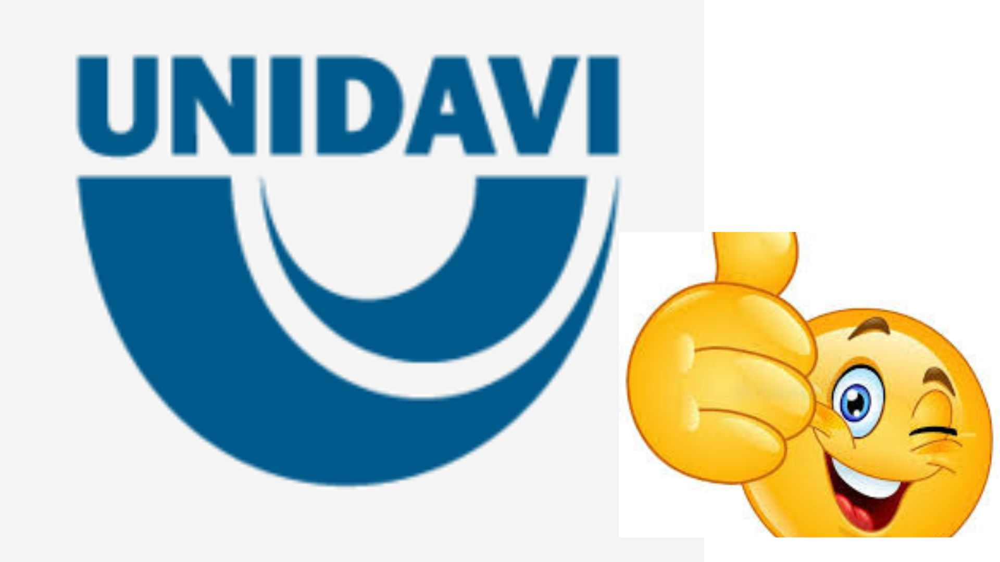

# UNIDAVI - Desenvolvimento Web 2025

## 📘 Exercícios

- [Aula 8](https://github.com/bernardounidavi1/bernardo_aula/aula8)





## Descrição
Neste repositório, serão adicionados todos os arquivos das atividades realizadas na disciplina de Desenvolvimento Web 1.


## Instalação
Passos para instalar e configurar o projeto:

```Bash
git clone https://...../.git
cd projeto
npm install


